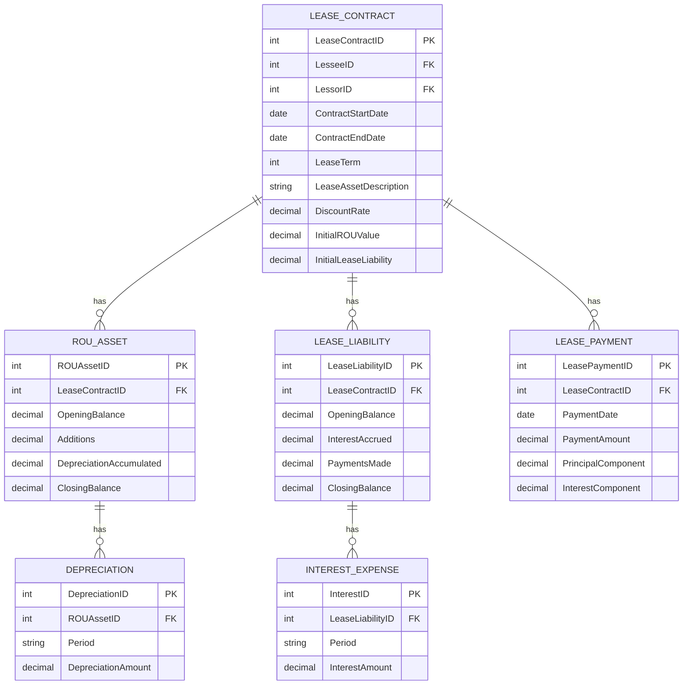

## lease in Scenario in the Books of Lessee

```mermaid
erDiagram
    LEASE_CONTRACT {
        int LeaseContractID PK
        int LesseeID FK
        int LessorID FK
        date ContractStartDate
        date ContractEndDate
        int LeaseTerm
        string LeaseAssetDescription
        decimal DiscountRate
        decimal InitialROUValue
        decimal InitialLeaseLiability
    }

    ROU_ASSET {
        int ROUAssetID PK
        int LeaseContractID FK
        decimal OpeningBalance
        decimal Additions
        decimal DepreciationAccumulated
        decimal ClosingBalance
    }

    LEASE_LIABILITY {
        int LeaseLiabilityID PK
        int LeaseContractID FK
        decimal OpeningBalance
        decimal InterestAccrued
        decimal PaymentsMade
        decimal ClosingBalance
    }

    LEASE_PAYMENT {
        int LeasePaymentID PK
        int LeaseContractID FK
        date PaymentDate
        decimal PaymentAmount
        decimal PrincipalComponent
        decimal InterestComponent
    }

    DEPRECIATION {
        int DepreciationID PK
        int ROUAssetID FK
        string Period
        decimal DepreciationAmount
    }

    INTEREST_EXPENSE {
        int InterestID PK
        int LeaseLiabilityID FK
        string Period
        decimal InterestAmount
    }

    %% Relationships
    LEASE_CONTRACT ||--o{ ROU_ASSET : has
    LEASE_CONTRACT ||--o{ LEASE_LIABILITY : has
    LEASE_CONTRACT ||--o{ LEASE_PAYMENT : has
    ROU_ASSET ||--o{ DEPRECIATION : has
    LEASE_LIABILITY ||--o{ INTEREST_EXPENSE : has
```
