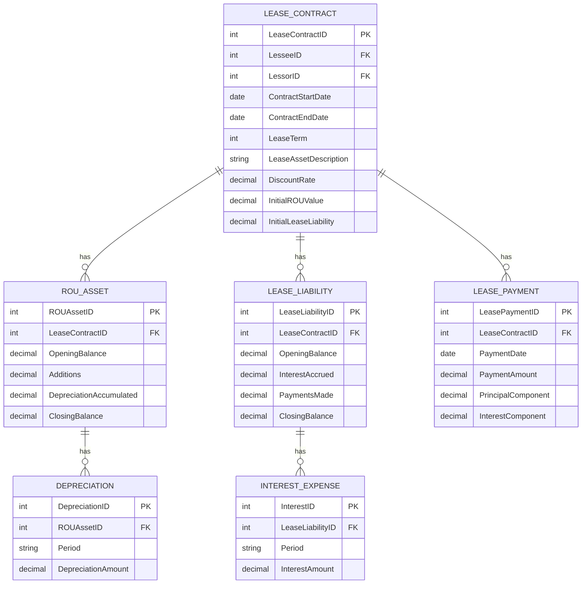
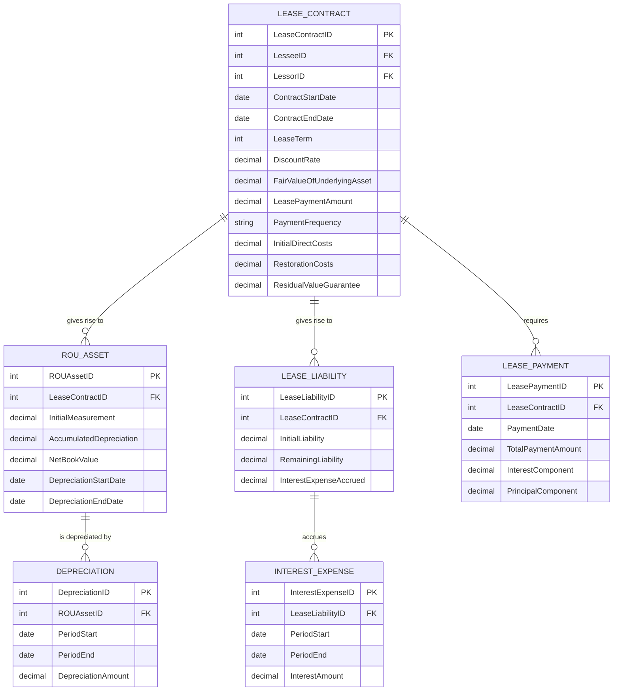
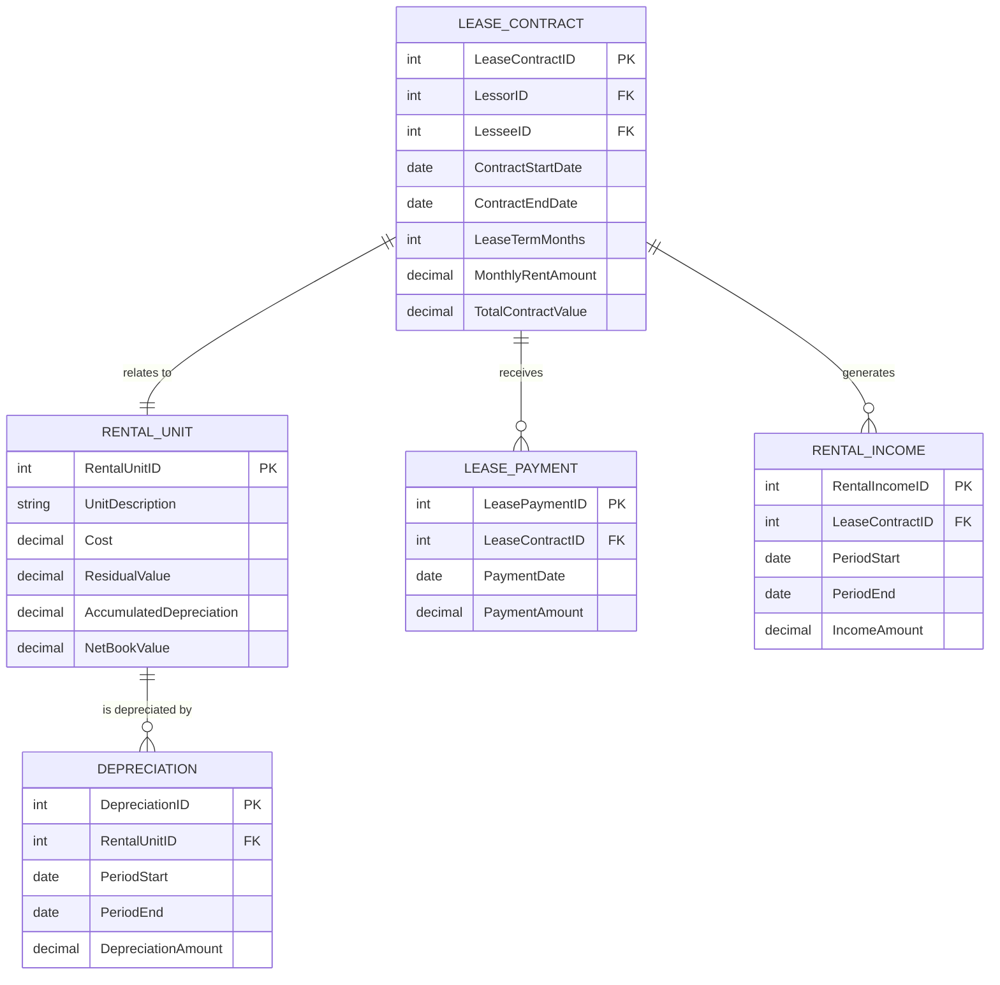

# Prompt : [Busineess] Give me mark up to create ERD for https://mermaid.live/
##  Scenario 01- Lease in Contract in the Books of Lessor- Need to change the Code

## In the Books of Lessee with IND AS116 Scenario 02

## In the Books of Lessor for Commercial lease out Scenario under indAS116

